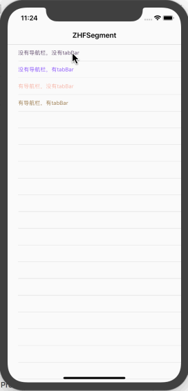
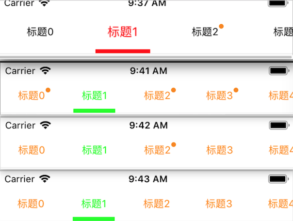

# ZHFSegment
### Swift 自定义分段控制器和使用

地址链接：

`
https://github.com/FighterLightning/ZHFSegment.git

---

效果图
 
       


####  效果图展现了该分段控制器的使用说明：（四种使用场景，已做过屏幕适配）

主要：下载该demo，把该demo的ZhfSegment文件复制到自己项目中

1.没有导航栏，没有tabBar（使用代码在demo的one文件）

2.没有导航栏，有tabBar（使用代码在demo的two文件）

3.有导航栏，没有tabBar（使用代码在demo的three文件）

3.有导航栏，有tabBar（使用代码在demo的four文件）

### demo分解：
#### ZhfSegment文件包含
##### ZHFSegmentVC.swift：分段控制器主框架
下面这是该分段控制器可根据项目需求修改定制内容
``` 
    /*常修改*/
    var titleScrollViewH :CGFloat = 44 // titleView 的高度
    var btnW :CGFloat = 100 //每个按钮的宽
    var selectId : NSInteger = 0 // 选中的ID （默认第一个）
    var pointArr = [0]{didSet{refreshAngle()}}//确定右上角是否有脚标(0为没有，大于0都有)
    var isScroll: Bool = true //是否可以滚动
    var titleColor = ZHFColor.black //title默认颜色
    var titleSelectedColor = ZHFColor.red //title选中颜色
    var titleScale :CGFloat = 1.3 // title有缩放效果，选中时是没选中的1.3倍
    var isHave_Navgation :Bool = true //是否有导航
    var isHave_Tabbar :Bool = false{didSet{refreshFrame()}}//是否有TabBar
```
##### ZHFColor.swift：自定义的一个颜色类(部分代码展示)
```
// 随机的颜色
    class func zhf_randomColor() -> UIColor {
        let r = CGFloat(arc4random() % 256) / 255.0
        let g = CGFloat(arc4random() % 256) / 255.0
        let b = CGFloat(arc4random() % 256) / 255.0
        return UIColor(red: r, green: g, blue: b, alpha: 1.0)
    }
```
#####  Common.swift：称放全局变量
```
//设备物理尺寸
let ScreenHeight = UIScreen.main.bounds.size.height
let ScreenWidth = UIScreen.main.bounds.size.width
let isIphoneX: Bool = ScreenHeight == 812 || ScreenHeight == 896 ?true:false
let navH: CGFloat = isIphoneX ? 89.0:64.0  //是否是刘海屏的导航高
let barH: CGFloat = isIphoneX ? 80.0:50.0  //是否是刘海屏的 tabBar 的高
```
###  以one文件为例来说明ZHFSegmentVC.swift控制器的使用方法
1.首先创建一个继承ZHFSegmentVC的控制器MainOneVC
2.设置相关属性
``` /*<------------可修改属性，默认的话可以不做处理------------->*/
        self.titleScrollViewH = 44 //默认是44 这个属性的位置不能和isHave_Navgation颠倒
        self.isHave_Navgation = false//如果没有导航栏记得设置这个属性（默认是true）
        self.isHave_Tabbar = false//如果有tabBar记得设置这个属性（默认是false）
        self.btnW = 80 //默认是100
        self.selectId = 1  //选中位置  默认是0
        self.titleScale = 1 //字体缩放倍数，默认是1.3, 设置成1不缩放
        self.titleColor = ZHFColor.orange
        self.titleSelectedColor = ZHFColor.green
        //默认是可以通过手势左右滚动 防止子控制器里有ScroolView造成手势冲突，改成false将不能滚动
        self.isScroll = true
        /*<-----------必须调用的方法-------->*/
        //添加子控制器
        setupAllChildViewController()
        //设置title
        setupAllTitle()
        /*<------------下面部分根据项目需求添加（不需要的话删除即可）------------->*/
        //设置titleBtn下划线 （如果没有注释掉即可）
        setTitleBtnBottomLine()
        //设置titleView下划线 （如果没有注释掉即可）
        setTitleViewBottomLine()
        //设置角标 （如果没有注释掉即可)
        //根据子控制器个数设置角标(设置角标一定要在设置title之后，0表示没有，1表示有)默认没有
        refreshOneAngle()
        setAngle()
```
3.添加子控制器
``` func setupAllChildViewController(){
        for i in 0 ..< 5 {
            //添加子控制器
            let mainOneChildVC: MainOneChildVC = MainOneChildVC()
            mainOneChildVC.title = "标题\(i)"
            mainOneChildVC.titleHeight = self.titleScrollViewH
            mainOneChildVC.view.backgroundColor = ZHFColor.zhf_randomColor()//为了区分控制器
            addChild(mainOneChildVC)
        }
    }
```
4.写子控制器相关内容
``` var titleHeight: CGFloat = 44.0 //这个是titleScroolView的高，防止中途修改我这里传过来使用，仅供参考
    var tableView:UITableView!
    lazy var dataMarr:NSMutableArray = NSMutableArray()
    override func viewDidLoad() {
        super.viewDidLoad()
        self.dataMarr = ["返回",
                         "新控制器",
                          "刷新角标",
        ]
         self.setUI()
    }
```
#### 其它三种情况和one文件使用情况类似，欢迎下载demo，如果觉得对您有帮助欢迎fork,star，如果有好的建议请留言指正。谢谢

