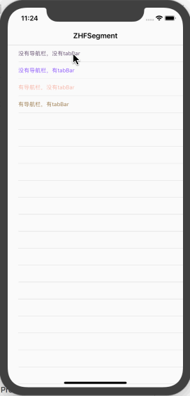
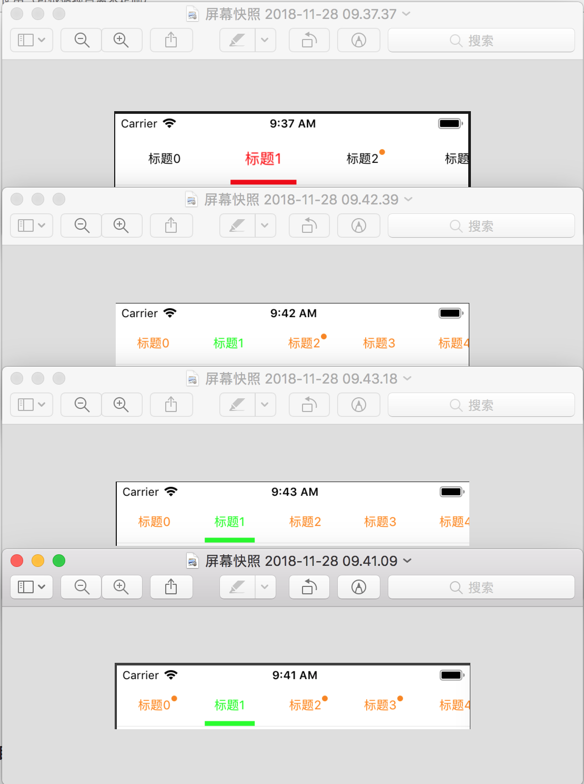

# ZHFSegment
### Swift 自定义分段控制器和使用

地址链接：

`
https://github.com/FighterLightning/ZHFSegment.git

---

效果图
 
       

####  效果图展现了该分段控制器的使用说明：（四种使用场景，已做过屏幕适配）

主要：下载该demo，把该demo的ZhfSegment文件复制到自己项目中

1.没有导航栏，没有tabBar（使用代码在demo的one文件）

2.没有导航栏，有tabBar（使用代码在demo的two文件）

3.有导航栏，没有tabBar（使用代码在demo的three文件）

3.有导航栏，有tabBar（使用代码在demo的four文件）

#### 使用详解请移步简书:

`
简书链接：https://www.jianshu.com/p/e4b49d606989

 
# PS

 如果感觉有帮助，感谢fork star！
